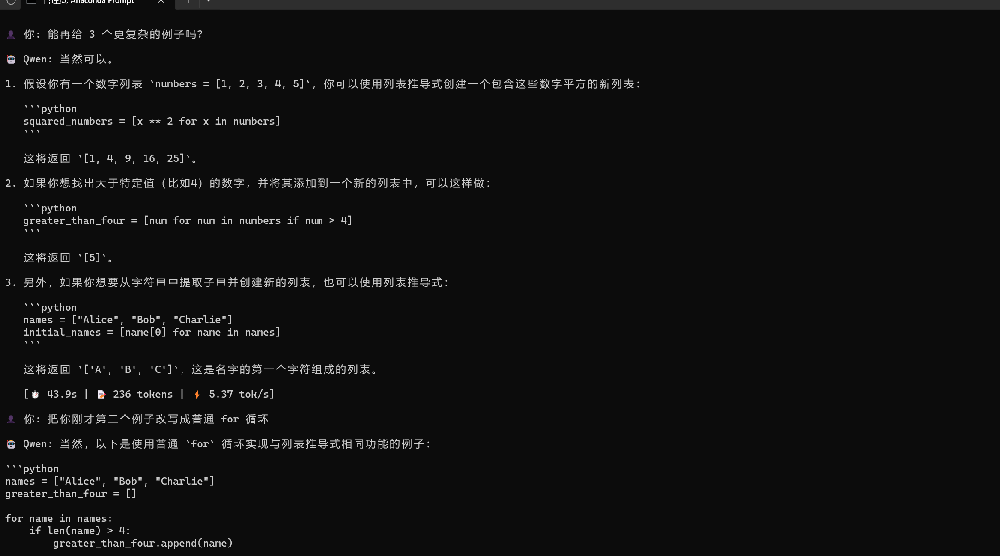

# 🎓 职教通 | Zhijiaotong

> 面向职业院校的 AI 教学助手 Agent 系统
> LLM + LoRA + RAG + Multi-Agent · 数据不出校园 · 本地离线部署


## 📸 Demo 演示



## 🎯 项目愿景

基于开源大模型 (Qwen2.5),结合 LoRA 微调、RAG 检索、多 Agent 编排技术,
打造面向职业院校一线教师的 AI 教学助手。核心能力:

- 🤖 **智能批改** - 自动批改 Python 编程作业,生成评分与评语
- 📝 **按纲出题** - 根据教学大纲自动生成练习题
- 📚 **教案生成** - 基于 RAG 检索公开教案,辅助备课
- 🔒 **本地部署** - Docker 一键启动,数据不出校园

## 🏗️ 系统架构
┌──────────────────────────────────────────┐
│  Teacher Dashboard (Web UI)              │
├──────────────────────────────────────────┤
│  Multi-Agent Orchestration (LangGraph)   │
├──────────────┬──────────────┬────────────┤
│ 批改 Agent   │  出题 Agent  │ 教案 Agent │
│ RestrictedPy │  LoRA Model  │    RAG     │
├──────────────┴──────────────┴────────────┤
│  Qwen2.5-7B (LoRA Fine-tuned)            │
└──────────────────────────────────────────┘
## 📅 开发进度

| 周次 | 主题 | 状态 |
|---|---|---|
| Week 1 | 环境搭建 + Qwen 推理 + 对话界面 | ✅ 完成 |
| Week 2 | Prompt Engineering 与评测基础 | ⏳ 规划中 |
| Week 3 | 批改 Agent MVP | ⏳ 规划中 |
| Week 4 | LoRA 原理与数据准备 | ⏳ 规划中 |
| Week 5 | LoRA 微调实战 | ⏳ 规划中 |
| Week 6 | RAG 与向量数据库 | ⏳ 规划中 |
| Week 7 | 多 Agent 编排 | ⏳ 规划中 |
| Week 8 | 前端集成 | ⏳ 规划中 |
| Week 9 | Docker 部署 | ⏳ 规划中 |
| Week 10 | 作品集整理 | ⏳ 规划中 |

## 🛠️ 技术栈

| 层级 | 技术 |
|---|---|
| 模型层 | Qwen2.5-7B · PEFT(LoRA) · bitsandbytes |
| Agent 层 | LangGraph · LangChain · ChromaDB |
| 应用层 | Gradio · FastAPI · SQLite |
| 部署层 | Docker · Docker Compose |

## 🚀 快速开始

```bash
# 1. 克隆仓库
git clone https://github.com/lizhiwei-stat/zhijiaotong.git
cd zhijiaotong

# 2. 创建环境
conda create -n zhijiao python=3.10 -y
conda activate zhijiao

# 3. 安装依赖
pip install -r requirements.txt

# 4. 下载模型
python scripts/download_qwen.py

# 5. 启动命令行对话
python scripts/chat_cli.py
```

## 📂 项目结构
zhijiaotong/
├── scripts/              # 核心脚本
│   ├── download_qwen.py           # Qwen 模型下载
│   ├── hello_qwen.py              # 首次推理演示
│   ├── tokenizer_experiment.py    # Tokenizer 实验
│   └── chat_cli.py                # 命令行对话界面
├── docs/                 # 文档与笔记
│   ├── day2_experiments.md        # 实验记录
│   ├── chats/                     # 对话历史存档
│   └── images/                    # 截图资源
├── models/               # 模型权重(gitignore)
├── data/                 # 数据集(gitignore)
├── notebooks/            # Jupyter 探索
├── src/                  # 主代码(开发中)
├── requirements.txt      # 依赖清单
└── README.md
## 🎯 Week 1 成果

- ✅ 完整的开发环境 (Python 3.10 + PyTorch 2.11 + Transformers 4.44)
- ✅ Qwen2.5-1.5B 本地推理 (CPU,约 5 token/s)
- ✅ 多轮对话命令行界面
- ✅ Tokenizer 行为实验 (发现中英文 token 效率差 2.3x)
- ✅ 对大模型能力边界的一手观察

## 👨‍💻 作者

**LZW** 


- 本项目为 10 周从零到一的完整作品集

## 📄 License

MIT License · 可自由使用与修改

---

⭐ 如果这个项目对你有帮助,欢迎 Star!